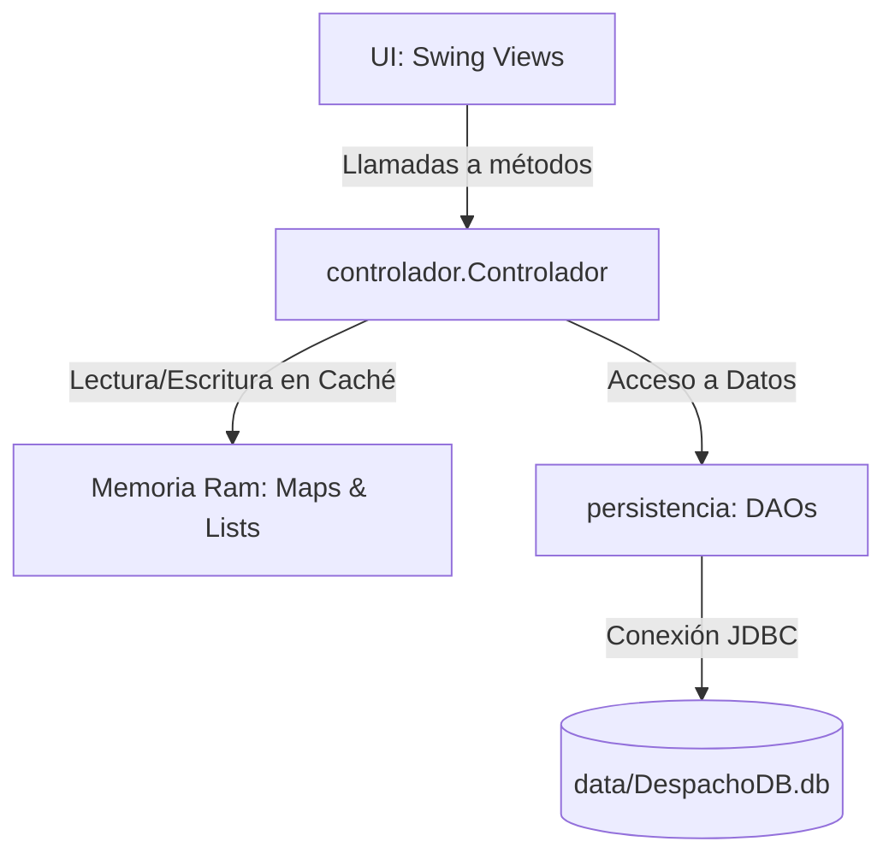

# Contexto Técnico para Gemini (Sesiones Futuras)

Este documento sirve como resumen técnico de arquitectura y patrones de implementación para facilitar la continuidad del desarrollo en futuras sesiones con asistentes de inteligencia artificial.

---

## 🏗️ Patrón Arquitectónico: MVC

El proyecto sigue un patrón **Modelo-Vista-Controlador (MVC)**, implementado de la siguiente manera:

### 1. Modelo (Entidades)
* Las clases en `entidades/` representan el modelo del dominio. 
* Utilizan herencia simple (`Cliente` y `Terceros` extienden a `Personas`).
* Representan colecciones de relaciones de base de datos en memoria como listas de IDs (ej. `idsRegimenes` en `Personas`, `idsClientes` en `Contadores`).

### 2. Controlador (Controlador / Orquestador)
* **`controlador.Controlador`** es un **Singleton** que actúa como el único punto de contacto de la UI con la lógica de negocio y la persistencia.
* **Caché en Memoria**: Para optimizar el rendimiento, el controlador almacena en memoria los datos mediante mapas y listas:
  * `Map<Integer, Contadores> contadores`
  * `Map<Integer, Cliente> clientes`
  * `Map<Integer, Declaracion> declaraciones`
  * `Map<Integer, EFirmas> eFirmas`
  * `ArrayList<Regimenes> regimenes`
  * `Map<Integer, Terceros> terceros`
* **Carga Inicial**: Al arrancar `Main.java`, se invoca `c.cargarTodo()`, lo cual extrae toda la base de datos a estas colecciones en memoria. A partir de ahí, las modificaciones de inserción, edición y eliminación se aplican tanto en la base de datos (mediante los DAOs) como en estas estructuras de memoria para mantener la consistencia.

### 3. Persistencia (DAOs)
* Las clases bajo el paquete `persistencia/` manejan la conexión y la ejecución de sentencias SQL crudas utilizando JDBC.
* `ConectorBD` provee el objeto `Connection` hacia SQLite de manera estática.

---

## 🔑 Aspectos Técnicos Críticos

### Flujo de Datos Típico (Ejemplo: Inserción de un Cliente)
1. La vista `UI.AñadirCliente` valida los campos de entrada utilizando `utils.Validator`.
2. Llama a `controlador.Controlador.insertCliente(cliente)`.
3. El controlador delega a `persistencia.ClientesDAO.insertCliente(cliente)`.
4. Si la inserción SQL es exitosa (retorna `"correcto"`), el controlador actualiza su mapa local en memoria `clientes` volviendo a consultar o agregando al mapa.
5. El controlador devuelve el estatus de la operación a la UI para mostrar una ventana emergente (`JOptionPane`).

---

## 📈 Áreas de Mejora Identificadas (Deuda Técnica)

* **Seguridad SQL**: Muchos DAOs concatenan valores directamente en las consultas SQL en lugar de usar `PreparedStatement` con placeholders (`?`), lo cual expone a la aplicación a inyección SQL (SQLi).
* **Manejo de Excepciones**: En varios métodos de persistencia, los bloques `catch` solo hacen `e.printStackTrace()` o imprimen en consola y retornan cadenas como `"error"`, en lugar de propagar excepciones personalizadas.
* **Actualización de la Caché**: Cuando un elemento se inserta o modifica, el controlador en ocasiones vuelve a realizar una lectura completa de la tabla en base de datos (`clientes = dBClientes.getClientes();`) en lugar de actualizar localmente la instancia en memoria, lo cual podría optimizarse.
* **Versión de Java**: El proyecto actualmente utiliza Java 8 de destino, lo cual impide el uso de características de Java moderno (como Records, Var, o colecciones inmutables mejoradas).
